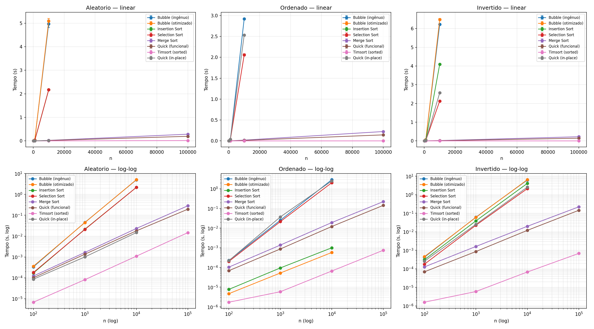

# Benchmark de Algoritmos de Ordenação em Python

Comparação empírica do desempenho de 6 algoritmos de ordenação
(mais variantes) estudados na disciplina de **Estrutura de Dados**.

## 📚 Algoritmos implementados

| Algoritmo | Pior caso | Médio | Melhor caso |
|---|---|---|---|
| Bubble Sort (ingênuo) | O(n²) | O(n²) | O(n²) |
| Bubble Sort (otimizado) | O(n²) | O(n²) | **O(n)** |
| Insertion Sort | O(n²) | O(n²) | **O(n)** |
| Selection Sort | O(n²) | O(n²) | O(n²) |
| Merge Sort | O(n log n) | O(n log n) | O(n log n) |
| Quick Sort (funcional) | O(n log n) | O(n log n) | O(n log n) |
| Quick Sort (in-place) | **O(n²)** | O(n log n) | O(n log n) |
| Timsort (`sorted`) | O(n log n) | O(n log n) | **O(n)** |

## 🧪 Metodologia

- **Tamanhos testados:** 100, 1.000, 10.000, 100.000
- **Cenários:** aleatório, ordenado, invertido
- **Repetições:** 3 por medição (média ± desvio padrão)
- **Medição:** `time.perf_counter()` (alta precisão)
- **Tempo total de execução:** 138,6 segundos

## 🎯 Principais resultados (n = 100.000, aleatório)

| Algoritmo | Tempo |
|---|---|
| 🥇 Timsort | **0,0147s** |
| 🥈 Quick (funcional) | 0,1950s |
| 🥉 Merge Sort | 0,2853s |

## 💥 Evidências empíricas notáveis

- **Bubble otimizado**: 5,09s (aleatório) → **0,0006s** (ordenado) = **8.483x mais rápido** — confirma O(n) no melhor caso
- **Insertion Sort**: 2,17s → **0,0010s** = **2.170x mais rápido** no ordenado
- **Selection Sort**: 2,17s / 2,06s / 2,13s nos 3 cenários — **praticamente igual** (O(n²) sempre)
- **Quick in-place**: 0,0148s (aleatório) → **2,53s** (ordenado) = **171x mais lento** — confirma O(n²) no pior caso
- **Timsort**: 0,0007s em n=100.000 invertido — O(n) no melhor caso

## 📊 Gráficos



## 📝 Análise crítica completa

Ver [`docs/respostas.md`](docs/respostas.md) para as respostas às 3 questões propostas.

## ▶️ Como executar

1. Instale as dependências:
   ```bash
   pip install -r requirements.txt
   ```

2. Rode o benchmark:
   ```bash
   python new_test.py
   ```

## 📂 Saídas geradas

- `outputs/benchmark_ordenacao.png` — 6 gráficos (3 cenários × linear/log-log)
- `outputs/relatorio_ordenacao.txt` — tabelas com média ± desvio

## 📚 Referências

- **SARAIVA JÚNIOR, Orlando.** *Estrutura de Dados — Ordenação*. Fatec Rio Claro, 2026. (material de aula em PDF, distribuído pelo professor)
- **SARAIVA JÚNIOR, Orlando.** *Exercícios — Ordenação*. Fatec Rio Claro, 2026. (lista de exercícios da disciplina)
- **AGARWAL, Basant.** *Hands-On Data Structures and Algorithms with Python*. 3. ed. Birmingham: Packt Publishing, 2022.
- **CANNING, John; BRODER, Alan; LAFORE, Robert.** *Data Structures & Algorithms in Python*. Boston: Addison-Wesley Professional, 2019.
- **RAMALHO, Luciano.** *Fluent Python: clear, concise, and effective programming*. 2. ed. Sebastopol, CA: O'Reilly Media, 2022. 1014 p.